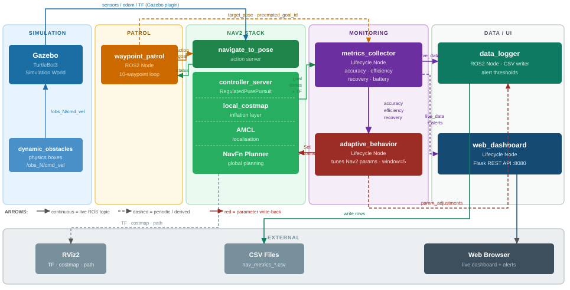

# tbot3_nav_monitor

Real-time navigation performance monitor and adaptive behavior controller for **TurtleBot3 Burger** running on **ROS2 Humble** with **Nav2** in **Gazebo Classic 11**.

The package observes a Nav2 navigation stack from the side, computes performance metrics live, dynamically reconfigures Nav2 parameters when navigation degrades, logs every metric tick to CSV, and exposes a web dashboard outside the container.


[](https://github.com/coenadasNR/tbot3_nav_monitor/raw/main/assets/demo.mp4)

---

## 1. Architecture



Six Python nodes, three of them lifecycle nodes:

| Node | Type | Purpose |
|---|---|---|
| `metrics_collector` | LifecycleNode | Observes Nav2 action status + TF, computes execution_time / nav_accuracy / path_efficiency / recovery_count / battery_pct |
| `adaptive_behavior` | LifecycleNode | Reads rolling 5-sample windows, dynamically calls `SetParameters` on `controller_server` and `local_costmap` |
| `data_logger` | Node | Writes timestamped CSV rows; publishes alerts when configurable thresholds are breached |
| `web_dashboard` | LifecycleNode | Flask server on port 8080: live metric cards, Chart.js trend lines, multi-environment summary table from CSV history |
| `waypoint_patrol` | Node | Cycles per-world waypoints via `NavigateToPose`; pauses for manual `/goal_pose` from RViz2 and resumes after completion |
| `dynamic_obstacles` | Node | Spawns and moves dynamic obstacles in the narrow world; not used in other worlds |

All inter-node communication uses ROS2 topics (`/nav_monitor/*`). The monitor subsystem never blocks Nav2. It consumes published state and never preempts it.

---

## 2. Prerequisites

| Platform | Required |
|---|---|
| **All** | Docker Desktop (or Docker Engine + Compose v2) |
| **Linux** | Native X11 (already present); the Linux-specific compose override mounts `/tmp/.X11-unix` |
| **macOS** | No host software is needed. Gazebo and RViz2 run inside a VNC container; open `http://localhost:6080` in any browser |
| **Windows** | [VcXsrv](https://sourceforge.net/projects/vcxsrv/). Install it and `run_windows.ps1` will start it automatically with the correct flags |

No ROS2 installation is required on the host. Everything runs inside the container; the dashboard is reachable from the host browser.

---

## 3. Quick start

### Linux

```bash
WORLD=obstacles MODE=amcl ./scripts/run_compose.sh
WORLD=house     MODE=amcl ./scripts/run_compose.sh
WORLD=narrow    MODE=amcl ./scripts/run_compose.sh
```

The script auto-detects Linux and mounts the host X11 socket.

### macOS

```bash
WORLD=obstacles MODE=amcl ./scripts/run_compose.sh
```

The script detects macOS and uses `docker-compose.mac.yml`, which starts an in-container virtual framebuffer (Xvfb), VNC server (x11vnc), and noVNC web proxy.
No XQuartz or any X server is needed on the host.

Once running, open **http://localhost:6080** in any browser to see Gazebo and RViz2.
Use the Openbox window manager (right-click the desktop for a menu) to move and resize windows.

### Windows (PowerShell)

```powershell
$env:WORLD="house"; $env:MODE="amcl"; .\scripts\run_windows.ps1
```

### Open the dashboard

Once Nav2 reports ready (~30 s after launch):

**[http://localhost:8080](http://localhost:8080)** is the metrics dashboard (all platforms).

The patrol begins automatically and goals start appearing on the dashboard.

---

## 4. Mapping a new world

```bash
# 1. Run in SLAM mode (default)
WORLD=narrow ./scripts/run_compose.sh

# 2. In a second terminal, drive the robot
docker compose exec sim ros2 run teleop_twist_keyboard teleop_twist_keyboard

# 3. When the map looks complete, save it
# Linux:
docker compose -f docker-compose.yml -f docker-compose.linux.yml exec sim \
  bash /ros2_ws/scripts/save_map.sh narrow
# macOS:
docker compose -f docker-compose.yml -f docker-compose.mac.yml exec sim \
  bash /ros2_ws/scripts/save_map.sh narrow
# Windows:
docker exec tbot3_nav_monitor-sim-1 bash /ros2_ws/scripts/save_map.sh narrow

# 4. Ctrl-C, then relaunch with MODE=amcl to use the new map
```

---

## 5. Adaptive behavior rules

Three independent rules, each with hysteresis to prevent oscillation. Rolling window: 5 samples at 0.5 Hz.

| Rule | Trigger | Action | Restore |
|---|---|---|---|
| **1: Slow down** | avg recovery ≥ 3 | `desired_linear_vel: 0.20 → 0.10`, `rotate_to_heading_angular_vel: 1.8 → 0.9` | avg recovery < 1.5 **and** efficiency healthy |
| **2: Relax tolerance** | avg accuracy > 0.40 m | `xy_goal_tolerance: 0.15 → 0.35` | avg accuracy < 0.20 m |
| **3: Conservative mode** | avg efficiency < 0.40 | `cost_scaling_factor: 3.0 → 5.0` (steeper inflation gradient → planner prefers corridor centres), velocity reduced as in Rule 1 | avg efficiency > 0.85 |

Rule 1's restore is gated on Rule 3. If efficiency is still poor, the velocity reduction is held even when recoveries normalise. This prevents the two rules from ping-ponging each tick.

Reconfiguration uses the standard ROS2 `SetParameters` service against `/controller_server` and `/local_costmap/local_costmap`. Nav2 applies the new values without restart.

---

## 6. Multi-environment testing

Three Gazebo worlds exercise progressively harder navigation challenges, each run with the adaptive behavior system enabled using an identical 10-waypoint outward-and-return patrol route.

| World | Description | Challenge | Source |
|---|---|---|---|
| `obstacles` | Open arena with a 3×3 cylinder grid | Replanning around static cylinder obstacles | `turtlebot3_world.world` |
| `house`     | Multi-room domestic environment | Door frames, corridors, long cross-room legs | `turtlebot3_house.world` |
| `narrow`    | Custom corridors with sub-1 m passages + 2 dynamic obstacles | Tight clearance, frequent recovery, replanning | `worlds/narrow_passages.world` |

### Results

| Metric | Obstacles | House | Narrow |
|---|---|---|---|
| Goals succeeded | 12 | 12 | 12 |
| Goals failed | 0 | 0 | 3 |
| Success rate | 100% | 100% | 80% |
| Avg path efficiency | 0.91 | 0.69 | 0.66 |
| Avg execution time | 9.84 s | 31.28 s | 20.82 s |
| Avg recovery count | 0.00 | 0.00 | 4.56 |
| Total distance (m) | 30.77 | 77.64 | 47.14 |
| Battery remaining | 98.5% | 96.1% | 97.6% |

### Analysis

**Obstacles world.** Open space with a 3×3 cylinder grid. Zero recoveries, 100% success rate, and the highest path efficiency (0.91). The raised `cost_scaling_factor` steers the planner toward corridor centres between cylinders, producing clean arcs with minimal redundant steering.

**House world.** Multi-room domestic layout with door frames and long cross-room legs. All 12 goals completed with zero recoveries. Efficiency of 0.69 reflects the geometrically forced detours through corridors; the adaptive system correctly holds parameters at their defaults (Rule 3 never fires) since efficiency stays above the 0.40 threshold.

**Narrow world.** The hardest environment: sub-1 m baffle passages with two dynamic obstacles oscillating through the corridors. The system logged 4.56 recoveries per goal on average and completed 12 goals with 3 failures (80% success rate). Failures occur when dynamic obstacle movement shifts the local costmap mid-plan, causing the global planner to find no feasible path through the tightest sections. The retry logic (up to 2 retries with 3 s delay) reduces but does not eliminate these aborts.

---

## 7. Comparison tools

### Run configuration

Two optional variables control how a run is labelled and whether the adaptive node runs:

| Variable | What it does | Default |
|---|---|---|
| `NAV_CONFIG` | Free-form label written into the CSV filename and dashboard row. Use it to name the run. | `adaptive` (or `baseline` if `NAV_ADAPTIVE=false`) |
| `NAV_ADAPTIVE` | Set to `false` to disable the `adaptive_behavior` node. Omit to keep it enabled | `true` |

**Linux / macOS**
```bash
# Adaptive (default): NAV_ADAPTIVE omitted, defaults to enabled
WORLD=house MODE=amcl ./scripts/run_compose.sh

# Adaptive OFF
WORLD=house MODE=amcl NAV_ADAPTIVE=false ./scripts/run_compose.sh

# Custom label + adaptive OFF
WORLD=house MODE=amcl NAV_CONFIG=my_config NAV_ADAPTIVE=false ./scripts/run_compose.sh
```

**Windows (PowerShell)**: pass as script parameters, not env vars:
```powershell
# Adaptive OFF
$env:WORLD="house"; $env:MODE="amcl"; .\scripts\run_windows.ps1 -NavAdaptive false

# Custom label + adaptive OFF
$env:WORLD="house"; $env:MODE="amcl"; .\scripts\run_windows.ps1 -NavConfig my_config -NavAdaptive false
```

Each run produces a separate CSV: `nav_metrics_{world}_{NAV_CONFIG}_{timestamp}.csv`. Running the same world with different labels lets `analyse.py` compare them side by side.

### Per-world analysis plots

Plots are generated by running the analysis script for each environment. Install dependencies first (one-time setup):

```bash
# Linux / macOS
python3 -m venv .venv
source .venv/bin/activate
pip install -r requirements.txt
```

```powershell
# Windows (PowerShell)
python -m venv .venv
.venv\Scripts\Activate.ps1
pip install -r requirements.txt
```

Then run the script:

```bash
# Linux / macOS
python3 scripts/analyse.py --data-dir data/csv --out-dir data/plots/<world> --world <world>
```

```powershell
# Windows (PowerShell)
python scripts/analyse.py --data-dir data/csv --out-dir data/plots/<world> --world <world>
```

They include summary bars, efficiency over time, recovery over time, execution time distributions, battery drain, and goal outcomes. See the respective `data/plots/<world>/` directories for all generated figures.

---

## 8. Web dashboard

Accessible at `http://localhost:8080` (port mapped from container).

- **World banner**: large per-world identifier with colour-coded accent
- **Goal status strip**: shows IDLE, ACTIVE (pulsing), SUCCEEDED, or FAILED status with running counts
- **Live metric cards**: execution time, accuracy, efficiency, recovery count, battery, and total distance, with amber/red threshold colouring
- **Trend charts**: last 60 s of accuracy, efficiency, and recovery (Chart.js, client-side rolling buffer)
- **Multi-environment summary**: table populated from `/api/summary`, refreshes every 30 s, served from a 25 s pandas cache
- **Recent alerts**: last 10 alerts with timestamps formatted in the browser's local timezone

Three JSON endpoints: `/api/metrics`, `/api/alerts`, `/api/summary`.

---

## 9. Manual goal interruption

Send a `/goal_pose` from RViz2 ("2D Goal Pose" tool) at any time. The patrol pauses, the robot navigates to the manual goal, monitoring tracks it the same as any patrol goal, and the patrol resumes from the next waypoint. Implementation handles four race conditions:
- patrol cancellation passes through `STATUS_CANCELING` before reaching `STATUS_CANCELED`
- the manual goal may be `EXECUTING` in the same `GoalStatusArray` message that reports the patrol cancellation
- Nav2 may emit `STATUS_ABORTED` for the old goal in the same tick that the next patrol goal is accepted; `waypoint_patrol` publishes the outgoing goal's UUID to `/nav_monitor/preempted_goal_id` before calling `send_goal_async`, so `metrics_collector` can classify it as preempted rather than a genuine failure
- 120 s timeout fallback if a manual goal never produces a terminal status

---

## 10. Testing

Tests run on the host with no container needed. `conftest.py` stubs all ROS2 packages.

Install dependencies first if you haven't already:

```bash
# Linux / macOS
python3 -m venv .venv && source .venv/bin/activate
pip install -r requirements.txt
```

```powershell
# Windows (PowerShell)
python -m venv .venv; .venv\Scripts\Activate.ps1
pip install -r requirements.txt
```

Then run from the repo root:

```bash
# Linux / macOS (PYTHONPATH="" prevents ROS2 system packages leaking into the venv)
PYTHONPATH="" .venv/bin/python -m pytest src/tbot3_nav_monitor/test/ -v
```

```powershell
# Windows (PowerShell)
python -m pytest src/tbot3_nav_monitor/test/ -v
```

68 unit tests (no live ROS2 required; `conftest.py` provides class stubs):

- **`test_adaptive_behavior.py`** (22): all three rules in isolation and combined, restoration paths, threshold oscillation, partial/empty windows, ping-pong regression
- **`test_metrics_collector.py`** (29): `compute_accuracy` and `compute_efficiency` purity, None-pose handling, zero-distance edge case, UUID-based preemption classification, ABORTED vs CANCELED branching
- **`test_data_logger.py`** (11): CSV writing, malformed JSON handling, all four alert thresholds at boundary conditions, and alert deduplication (fires once, clears on recovery, re-fires on re-trigger)
- **`test_web_dashboard.py`** (6): lifecycle resource management covering deactivate stops Flask, cleanup destroys subscriptions, `_stop_flask` shuts down server and clears refs, no-op when server not running, no-op start when already running, and Flask thread startup

---

## 11. Repository layout

```
tbot3_nav_monitor/
├── Dockerfile                  # multi-stage: builder (colcon) + lean runtime
├── docker-compose.yml          # cross-platform: bridge net + ipc:host for DDS
├── docker-compose.linux.yml    # Linux X11 socket overlay
├── docker-compose.mac.yml      # macOS VNC overlay (Xvfb + x11vnc + noVNC)
├── scripts/
│   ├── run_compose.sh          # Linux/macOS launcher (OS-detect)
│   ├── run_windows.ps1         # Windows PowerShell launcher (auto-starts VcXsrv)
│   ├── start_vnc.sh            # macOS: starts Xvfb + x11vnc + noVNC inside container
│   ├── save_map.sh             # SLAM map serialisation
│   └── ros_entrypoint.sh       # container entrypoint
├── src/tbot3_nav_monitor/
│   ├── package.xml
│   ├── setup.py
│   ├── launch/                 # 4 launch files (per-world sim × 3 + monitor)
│   ├── config/                 # nav2_params*.yaml + nav_monitor.rviz
│   ├── tbot3_nav_monitor/      # 6 nodes (5 core + dynamic_obstacles for narrow world)
│   └── test/                   # 68 unit tests + conftest.py
├── worlds/                     # narrow_passages.world (custom)
├── maps/                       # saved AMCL maps for all three worlds
├── data/csv/                   # runtime-generated metric logs
└── README.md
```

---

## 12. Docker Hub

```bash
docker pull coenanr/tbot3_nav_monitor:latest
WORLD=obstacles MODE=amcl docker compose up
```

Image tag: `coenanr/tbot3_nav_monitor:latest`.

---

## 13. Implementation notes

- **Lifecycle nodes** are used wherever the node has external dependencies (Nav2, TF, action server, Flask). The `on_configure` method creates subscriptions and `on_activate` starts timers, ensuring clean startup ordering.
- **Path efficiency** is computed as `‖target − start‖ / actual_path_length`, snapshotting `target` and `start` at goal-start so a preempting manual goal cannot corrupt the metric of the goal it preempted.
- **Battery** is a fictional metric drained linearly with distance travelled (0.05 % per metre). It is included to satisfy the assignment's required metric set and is not derived from any real sensor.
- **CSV logging** writes 2 Hz time-series; the `/api/summary` endpoint filters this down to one row per completed goal for analysis (detecting `goals_completed` increments via pandas `diff().fillna(0) > 0`).
- **Cross-container DDS** uses `ipc: host` and a shared `/dev/shm` mount so FastDDS shared-memory transport works between the `sim` and `monitor` services on a bridge network. This is required for ROS2 actions to discover across containers.
- **Manual goal interruption** is purely additive. The `waypoint_patrol` node subscribes to `/goal_pose` and `/navigate_to_pose/_action/status` and never cancels Nav2 itself. It only refrains from sending the next patrol goal until the action server is idle again.

---

## License

Apache-2.0. See `src/tbot3_nav_monitor/package.xml`.
